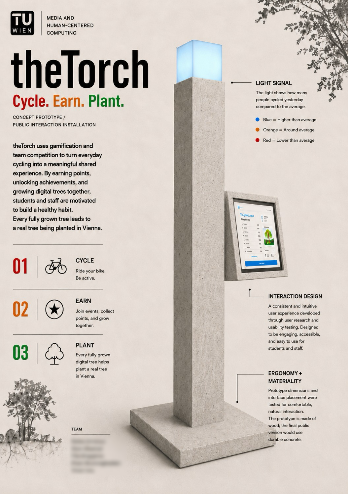
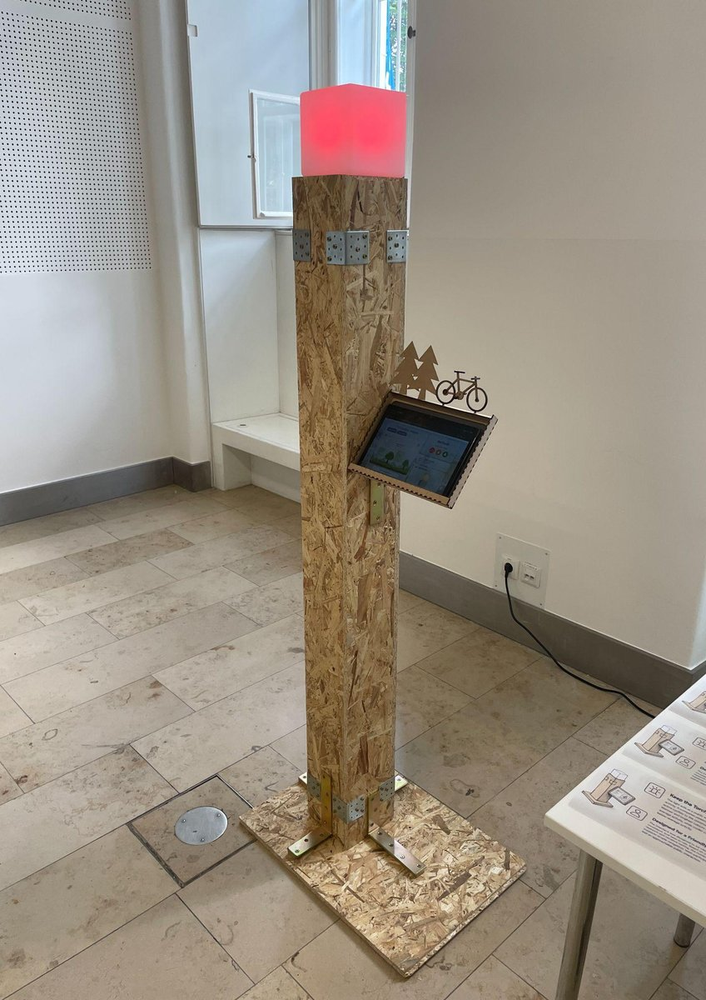
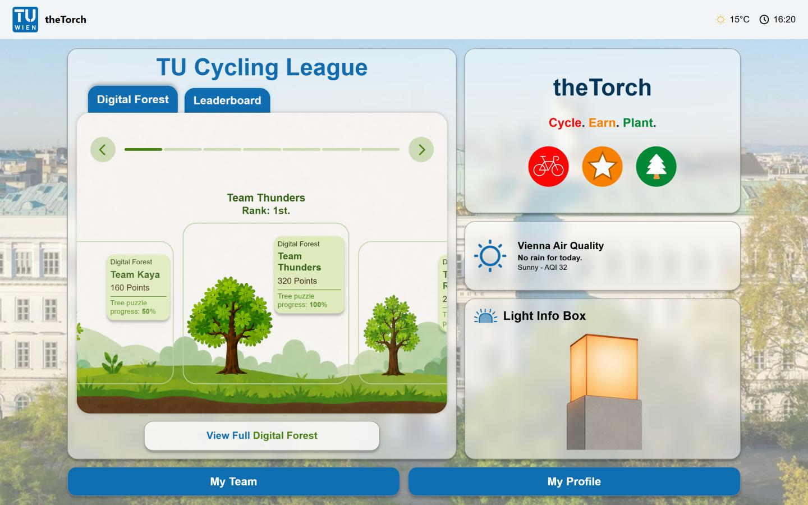
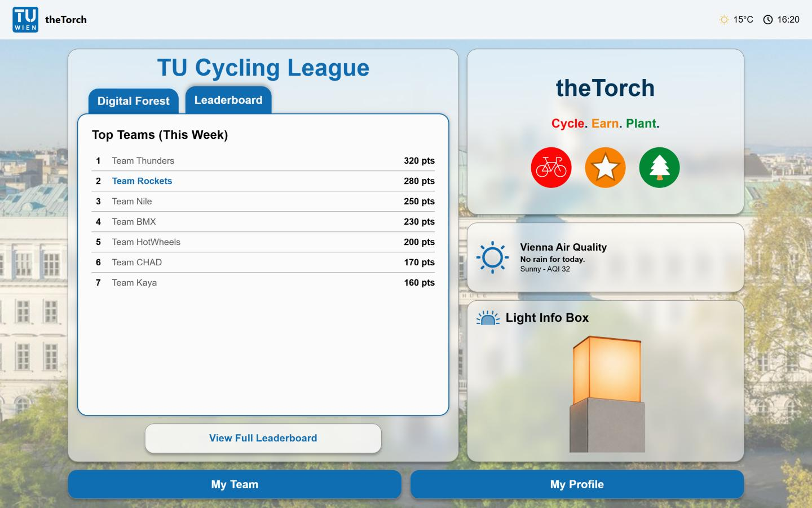
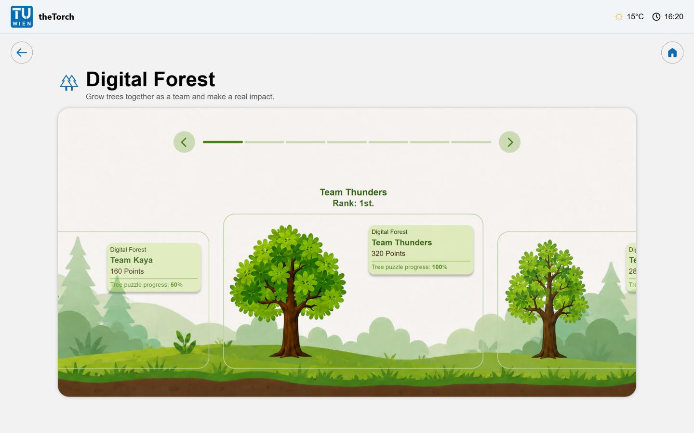
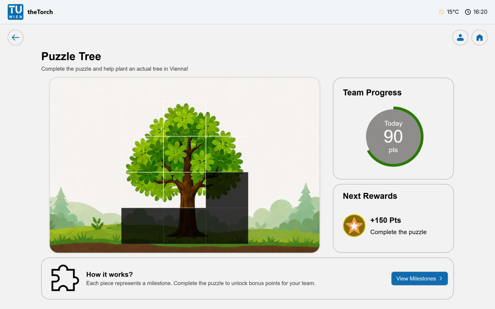
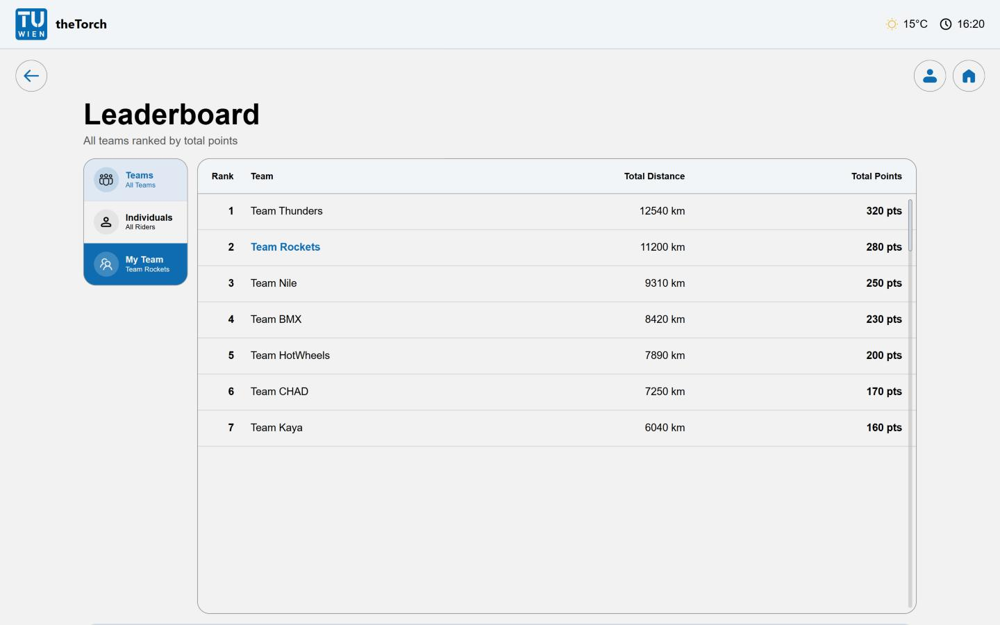
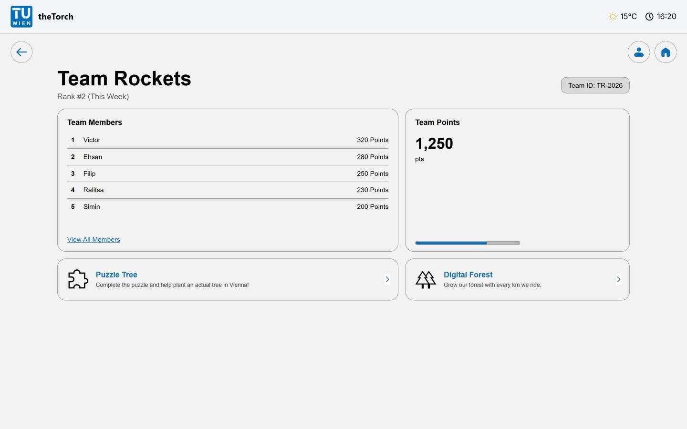
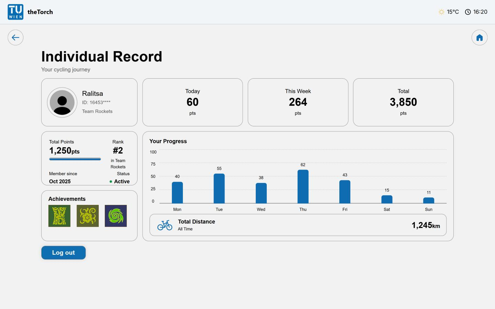

# theTorch

A web-based cycling gamification platform for students, developed as part of a **Design Thinking: Explorative Prototyping** course. Riders cycle, earn points, compete in teams, and grow a shared **Digital Forest** that reflects real-world environmental impact.

## Tech Stack
- **Backend:** Java, Spring Boot, SQLite
- **Frontend:** Angular, TypeScript, HTML, CSS

## Features
- User registration, login, and joining or creating a cycling team
- Team and individual leaderboards ranked by points and distance
- Team dashboard with member rankings and team progress
- Individual profile with personal stats, achievements, and cycling progress
- Digital Forest that grows as teams accumulate collective riding distance
- Puzzle Tree team challenge with unlockable pieces tied to planting a real tree in Vienna

## Physical Prototype

  
  

## Interface

### Home

### Home – Leaderboard tab

### Digital Forest

### Puzzle Tree

### Team Leaderboard

### Team Page

### Profile

